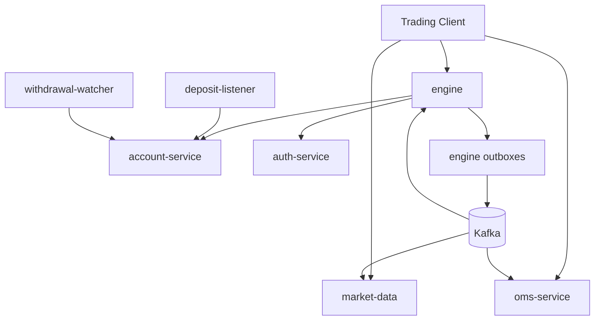

# Architecture

- Audience: Trading API Integrators
- What this page explains: Service responsibilities, data flow, Kafka topics, and data ownership boundaries.
- Where to go next: Read [Reliability Model](reliability.md), then implementation-level docs in [API.md](../../API.md) and [OMS.md](../OMS.md).

## Service Responsibilities
- `engine`: Order entry, validation, matching, and trading state transitions.
- `account-service`: Balance source of truth, settlement, withdrawals, and related account state.
- `auth-service`: User auth and API key verification.
- `oms-service`: Order read model for open orders and order history.
- `market-data`: Market-facing depth/trade/kline APIs and WebSocket streams.
- `deposit-listener`: Watches chain deposits and forwards credit events.
- `withdrawal-watcher`: Watches chain-side withdrawal execution and confirms status.

## Service Topology

## Kafka Topics and Mapping
| Topic | Produced by | Consumed by | Purpose |
| --- | --- | --- | --- |
| `orders` | engine | oms-service | Order lifecycle events for OMS read model |
| `trades` | engine | market-data, account-service (settlement flows) | Executions/trade stream |
| `orderbook-deltas` | engine | market-data | Incremental depth updates |
| `account.updates` | account-service | engine | Cache synchronization for balances |

## Source of Truth vs Cache/Read Model
| Domain | Source of truth | Cache / read model |
| --- | --- | --- |
| Matching state for live execution | engine in-memory + WAL | market-data depth reconstruction |
| User balances/accounting | account-service DB/state | engine account cache |
| Order query views | OMS (from event stream) | N/A |
| Market data query views | market-data (from event stream) | N/A |

## Integration Implication
For trading actions, use engine endpoints. For query-focused user order views, use OMS. For charting/live market streams, use market-data.
