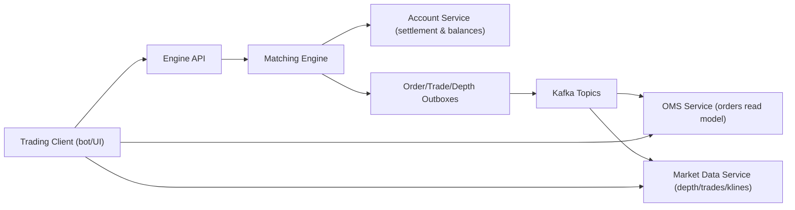

# Introduction

- Audience: Trading API Integrators
- What this page explains: What this trading system is, who it serves, and the main integration paths.
- Where to go next: Read [Order Lifecycle](order-lifecycle.md), then [Concepts](../concepts/README.md), then [API.md](../../API.md).

## What This Platform Is
This repository provides an offchain orderbook venue with a matching engine and surrounding services for auth, balances, order history, and market data.

As an integrator, you primarily interact with:
- Trading REST endpoints on the engine (`/orders`, `/orders/cancel`, `/orders/cancel_all`, etc.)
- Market and stream data from market-data (`/klines`, `/ws`)
- OMS read model endpoints for open orders and order history

## Who This Is For
This docs path is for developers building:
- Trading bots
- Exchange/venue connectors
- Broker adapters
- Trading UIs that need live depth/trades and order status

## Integration Paths
1. Trading path
- Authenticate with JWT or API key/secret (as configured).
- Place/cancel orders on engine APIs.

2. Market data path
- Read depth/trades/klines over REST/WebSocket via market-data.

3. Account/order status path
- Read balances/account views (engine/account-service surfaces).
- Read open/history order views through OMS.

## High-Level Flow

## Read Next
- [Order Lifecycle](order-lifecycle.md)
- [Orderbook Mechanics](../concepts/orderbook.md)
- [Architecture](../concepts/architecture.md)
- [Engine REST API](../../API.md)
- [WebSocket Channels](../../WEBSOCKET.md)
