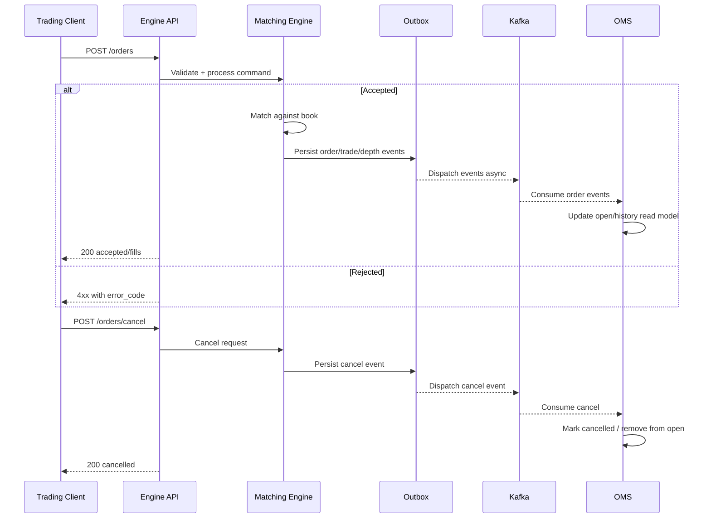

# Order Lifecycle

- Audience: Trading API Integrators
- What this page explains: End-to-end behavior for place/cancel operations and where order state is observed.
- Where to go next: Review [Orderbook Mechanics](../concepts/orderbook.md), then exact endpoint details in [API.md](../../API.md) and [OMS.md](../OMS.md).

## Place Order Path
1. Client submits an order to engine (`POST /orders` or `POST /signed_orders`).
2. Engine validates pair state, market state, and order constraints.
3. Engine matches immediately against opposite-side liquidity where possible.
4. If quantity remains and order type allows resting, the remaining order becomes `open` on the book.
5. Engine publishes events (durable outbox first, then async dispatch to Kafka/sinks).
6. OMS consumes order events and updates open/history read models.

## Match Outcomes
- `filled`: Order is fully executed immediately.
- `partially_filled`: Part executes; remainder may stay `open` if order type can rest.
- `open`: No immediate full execution and remaining amount rests on the book.
- `cancelled`: Resting order is cancelled.
- reject: Validation or market/pair state rules reject the request (`error_code` in response).

## Cancel Path
1. Client calls `POST /orders/cancel` with `pair_id` and `order_id`.
2. Engine checks ownership/auth context and order existence.
3. If found and cancellable, engine removes it from the book and returns `cancelled`.
4. Cancellation event is emitted; OMS reflects this in history and removes from open set.

## Where To Read Open Orders and History
- Open orders: OMS `GET /orders/open/:user_id`
- Order history: OMS `GET /orders/history/:user_id`
- Single order lookup: OMS `GET /orders/:order_id`

Use OMS for user-facing order state views. Engine is the execution system of record; OMS is the query/read model.

## Sequence Diagram

