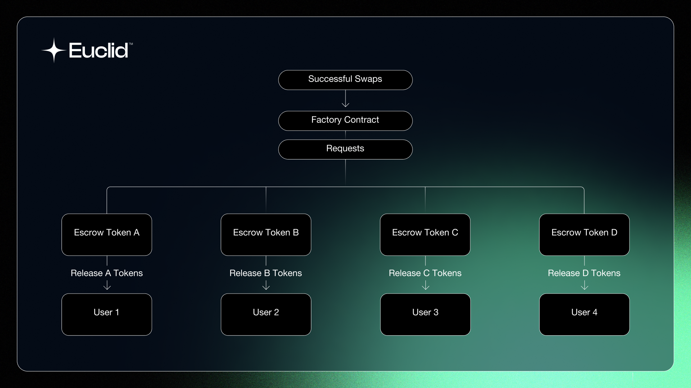

# Escrows 

The Escrow smart contract is a simple contract that holds one type of token. Each integrated chain will have these escrows deployed, holding the liquidity for the tokens. Whenever a swap is successful, the factory contract of the chain will forward a message from the router to the escrow requesting a release of tokens to the user who initiated the swap. 

The Escrow has a line of communication with the Virtual Pool (through the Factory and Router) that allows for messaging to move tokens when appropriate. There are two main cases whenever a user sends out a token A to be swapped for a token B:

:::tip
Each Escrow holds only one type of token.
:::

- If a transaction is successful, an Escrow successfully stores the A tokens, and the B tokens are released to the user by another escrow.

- If a transaction fails (high slippage) or is timed out, the A tokens are returned back to the user. 

:::tip
Euclid's algorithm ensures that releasing tokens is done in the most efficient way. This means that some swaps will see tokens released from different escrows from different chains and then sent back to the user's original chain. From the user's perspective, the transaction was completed like any ordinary swap.

We will dive deeper into each of the Escrow's execute and query messages in the [Escrow Smart Contract](../../../Euclid%20Smart%20Contracts/Escrow.md) section.

:::

 