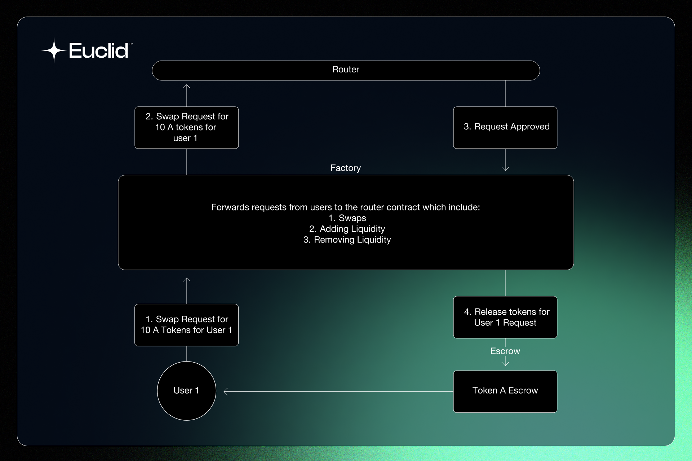

# Factory

## Introduction

The Factory smart contract serves as the core component for managing user interactions with liquidity pools and performing swaps. Its primary role is to handle requests from users and communicate these requests to the [router contract](../router). The factory contract simplifies user interactions by providing a single point of access for various operations, such as swaps, adding liquidity, and removing liquidity. 

:::note
Each integrated chain will have a Factory contract deployed by Euclid.
:::

## Single Entry point for Requests

The Factory contract is the sole point of communication between the chains and the VSL. This is beneficial for the system for the following reasons:

- **Streamlined Processing for Requests:** This ensures that all requests coming from a single chain are processed in a streamlined manner by the factory, removing the possibility of inconsistencies or conflicts that could arise from handling requests in multiple locations and ensuring that operations are executed in the correct sequential order.

- **Improved Security:** Having all messages pass through a single factory facilitates the implementation of security measures that ensure that all requests received are legitimate.

- **Simplified Developer Experience:** Protocols looking to integrate and use the Euclid layer will only need to interact with one contract, being the factory contract. This simplification greatly decreases the complexity of using the Euclid layer, making the developer experience as smooth as possible.

## Workflow

The following diagram illustrates the workflow of the factory contract for a swap request:
:::tip
We will dive deeper into each execute and query messages in the [Factory Smart Contract](../../../Euclid%20Smart%20Contracts/CosmWasm/Factory.md) section.
:::

 

1. User sends the swap request to the factory
2. Factory forwards the message to the router through a dedicated channel
3. Router forwards the messsage to the VSL where the calculations are performed for the swap
4. VSL returns an acknowledgement to the router 
5. Router forwards the ack to the factory through the dedicated channel
6. Factory forwards the ack to the escrow to release the tokens to the user

:::note
In case the ack is an error, the user is refunded and all the state changes are reverted.
:::
