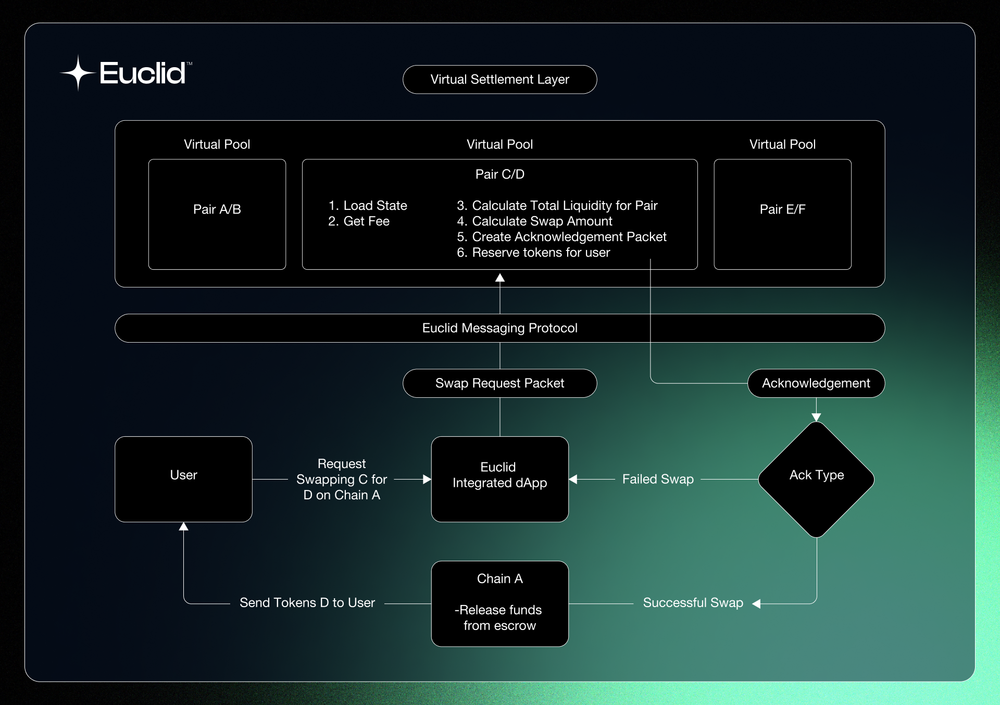

# Virtual Pools

## Introduction

Euclid **Virtual Pools** are responsible of keeping track and settling transactions across the Euclid layer for a certain token pair. Any token pair across the entire ecosystem will have to settle its transaction in that pool for the swap to be considered final.

Virtual Pools *solely* exist on the **Virtual Settlement Layer** and never hold any tokens but rather keep track of all existing tokens for the token pair in the Euclid ecosystem. These virtual pools allow us to unify the liquidity across the blockchain without actually having to bridge or move the tokens from one chain to another. This ensures that liquidity remains *decentralized* and *modular*.

## Workflow

:::tip
We will dive deeper into each of the contract's messages and queries in the [Euclid Smart Contracts](../../../Euclid%20Smart%20Contracts/Virtual%20Liquidity%20Pools.md) section.
:::

The following diagram illustrates the interaction between the VLP and the rest of the Euclid system.

## Guaranteed Finality

Since Virtual Pools exist on a Virtual Settlement Layer, all transactions performed are finalized and committed to a blockchain before being relayed back to any pool on the chain, ensuring that any change is finalized in sequence before another transaction is committed to avoid any double spending or similar exploits.