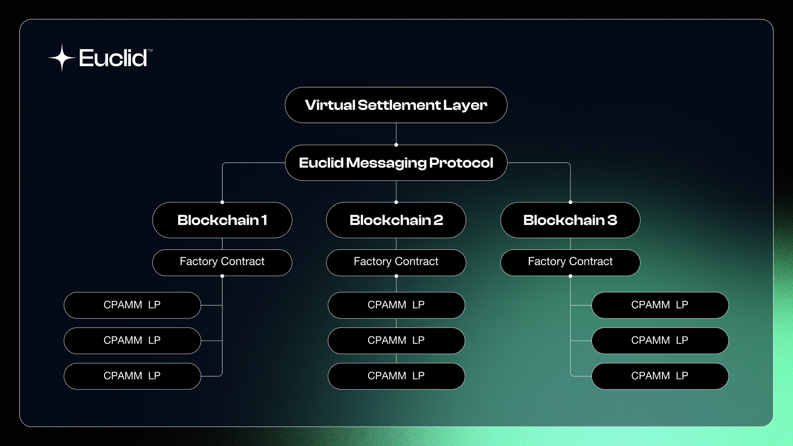

The **Unified Liquidity Layer** has three main components:

**A. Virtual Settlement Layer for Liquidity (VSL):** The VSL is a layer built on the hub chain and is responsible for consolidating all the virtual pools and performing the necessary calculations for swaps.

**B. Euclid Messaging Protocol (EMP):** The EMP is a protocol built on top of the existing IBC (Inter-Blockchain Communication) protocol that facilitates communication between the VSL and all Euclid integrated blockchains.

**C. Native Smart Contracts:** A set of smart contracts deployed on each integrated chain responsible for pool creation and communication with the Virtual Settlement Layer using EMP.

:::note
The bottom layer acts like a CPAMM pool but is in fact a series of escrows. We will dive deeper into it in later sections.
:::

### Virtual Settlement Layer

To keep liquidity decentralized, Euclid unifies liquidity **virtually** in its **Virtual Settlement Layer**. Euclid's VSL ensures instant finality where all liquidity across the blockchain is tallied, computed, and settled. Euclid's VSL is capable of supporting over 40,000 transactions per second. 

### Virtual Pools

Virtual Pools are the main component of the VSL based on Cosmwasm Smart Contracts. Virtual Pools are pools that are responsible for tallying the liquidity for a certain token pair across the entire Euclid layer. They allow external systems to query and retrieve detailed information about the Virtual Pool, including token pair details, overall liquidity status, pending swaps and liquidity additions, and current token reserves.

All liquidity across all integrated blockchains is settled in the Virtual Pool which then sends results back to the Euclid pools across the ecosystem.

## Euclid Messaging Protocol
:::note
By integrating with [Axelar](https://www.axelar.network), Euclid is able to unify liquidity for all chains regardless of the ecosystem they are found in.
:::
The **Euclid Messaging Protocol** (EMP) is a cross-chain messaging protocol that is built on IBC. Although IBC is mainly built for the Cosmos Ecosystem, EMP extends IBC across the entire blockchain space.

### Trustless Messaging

**EMP** allows guaranteed finality messaging between blockchains through decentralized [relayers](https://tutorials.cosmos.network/academy/2-cosmos-concepts/13-relayer-intro.html). Euclid's Relayers allow for trustless messaging between blockchain, since the relayers are built in a way that you only need to trust the blockchain and not the relayers themselves as they only relay a secured hash of the message.

This ensures that exploits seen in other bridges can't occur through our messaging by sending malicious messages.

### Guaranteed Finality

Our Messaging Protocol and Virtual Settlement Layer both guarantee instant finality of transactions across the entire blockchain, which ensures user funds will never be stuck in any smart contract on any blockchain.

## Liquisync Model

LiquiSync is the architecture that allows for liquidity to exist where it is needed most. This means that to ensure that an integrated chain has enough liquidity to release tokens when it needs to due to a certain transaction. The Euclid smart contracts have been designed to follow this model to ensure liquidity is always available to users.

Liquisync also ensures routing a token through the best route for the best price and slippage rates. This is achieved using Graph algorithms through the API microservice. 

