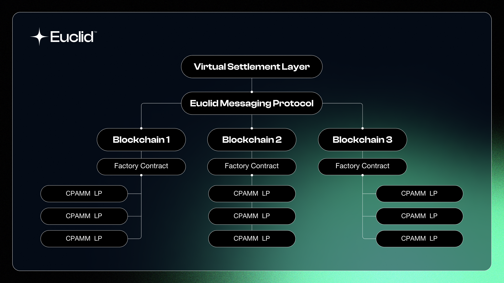

The **Unified Liquidity Layer** has three main components:

**A. Virtual Settlement Layer for Liquidity (VSL):** The VLS is a layer built on the hub chain Nibiru that is responsible for consolidating all the virtual pools and performing the necessary calculations for swaps.

**B. Euclid Messaging Protocol (EMP):** The EMP is a protocol built on top of the existing IBC (Inter-Blockchain Communication) protocol that facilitates communication between the VSL and all Euclid integrated blockchains.

**C. Native Smart Contracts:** A set of smart contracts deployed on each integrated chain responsible for pool creation and communication with the Virtual Settlement Layer using EMP.

## Virtual Settlement Layer

To keep liquidity decentralized, Euclid unifies liquidity **virtually** in its Virtual Settlement Layer. Euclid's VSL is a layer-1 blockchain with instant finality where all liquidity across the blockchain is tallied, computed and settled. 

Euclid utilizies [Nibiru Chain](https://nibiru.fi/) as its VSL due to its DeFi focused approach, instant finality architecture, and optimized block space to support over 40,000 TPS (Transactions per Second). With Nibiru's goal of being the DeFi Hub of the blockchain,
and its extensive roadmap and integrations, it makes sense for Euclid's VSL to be on Nibiru.

### Virtual Pools

Virtual Pools are the main component of the VSL based on Cosmwasm Smart Contracts. Virtual Pools are pools that are responsible for tallying the liquidity for a certain token pair across the entire Euclid ecosystem. They allow external systems to query and retrieve detailed information about the Virtual Pool, including token pair details, overall liquidity status, pending swaps and liquidity additions, and current token reserves. 

All liquidity across the blockchain is settled in the Virtual Pool which then sends results back to the Euclid pools across the ecosystem. 

## Euclid Messaging Protocol

The **Euclid Messaging Protocol** (EMP) is a cross-chain messaging protocol that is built on IBC. Although IBC is mainly built for the Cosmos Ecosystem, EMP extends IBC across the entire blockchain with integrations with Axelar, Skip Protocol, CCTP etc...

### Trustless Messaging

**EMP** allows guaranteed finality messaging between blockchains through decentralized [relayers](https://tutorials.cosmos.network/academy/2-cosmos-concepts/13-relayer-intro.html). Euclid's Relayers allow for trustless messaging between blockchain, since the relayers are built in a way that you only need to trust the blockchain and not the relayers themselves as they only relay a secured hash of the message. 

This ensures that exploits seen in other bridges can't occur through our messaging through sending malicious messages. 

### Guaranteed Finality

Our Messaging Protocol and Virtual Settlement Layer both guarantee instant finality of transactions across the entire blockchain which ensures user funds will never be stuck in any smart contract on any blockchain.