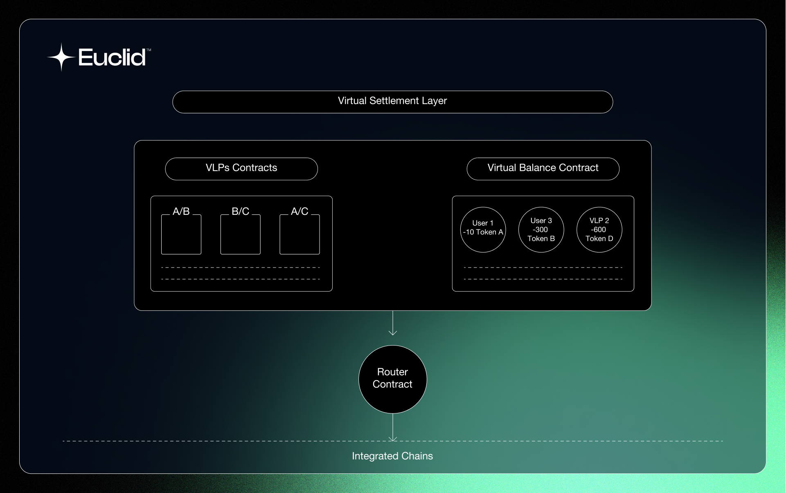

# Overview

A Virtual Settlement Layer (VSL) serves as the backbone of the Euclid system, responsible for settling all transactions securely and efficiently. To fulfill this crucial role, a VSL requires the following components and characteristics:

###  State Machine 

The VSL is required to be a **state machine**, which is a system that can be in a finite number of states. Every transaction processed by Euclid needs to be finalized, and needs to trigger a transition to a new state in order to ensure sequencing of trades in a certain pool.

A blockchain ensures that all nodes validate a transaction and its validity before committing to a new state.

###  Instant Finality

Euclid requires a VSL that offers **instant finality**. Instant finality is when a state transition is complete (block is committed), the state is immediately considered final (unlike blockchains like Bitcoin and Ethereum that have waiting periods and confirmations). This ensures that Euclid can guarantee fast transactions, as well as minimizes the risks associated with transaction rollbacks.

### Scalability 

Since Euclid's VSL would process and settle transactions for numerous Euclid integrated blockchains, that will grow with time, the VSL needs to be able to process a high number of transactions per second while maintaining security and decentralization. 

### Security

Although Euclid puts all the required checks and security barriers in place to ensure the security of the system, a secure VSL ensures that the Euclid system operates without any downtime. The VSL needs to be able to protect itself from any 51% attack, double-spending, and various other forms of exploits.

### Interoperability

Euclid requires a VSL that is able to connect efficiently with the Euclid Messaging Protocol. This is crucial to be able to facilitate cross-chain messaging from different ecosystems.

## Nibiru Chain

The Hub and VSL of Euclid will be on [Nibiru Chain](https://www.nibiru.fi), as the chain has all of the requirements for a VSL due to its optimized arcitecture:

1. **Tendermint Core:** Nibiru utilizes [Tendermint Core](https://tendermint.com/core/) as its consensus engine that ensures a decentralized state machine with instant finality.

2. **Superior Performance:** Due to Nibiru's optimized architecture, it offers very low block times (~1.4s) with maximum capacity that allow to process around 40,000 transactions per second. Nibiru represents a 1,300x improvement and a 4x advance on standard performance of chains leveraging the battle tested CometBFT consensus algorithm (previously known as Tendermint Core). This is done by Nibiru leveraging parallel optimistic execution.

3. **Secure:** Nibiru has 150+ different validators that secure the blockchain from different locations, ensuring a sufficiently decentralized system that ensures uptime of the Euclid system. 

4. **IBC enabled**: Nibiru integrates [IBC protocol](https://www.ibcprotocol.dev/), which allows for complete integration of the Euclid Messaging Protocol.

To read more about Nibiru Chain and what they offer, check out their [docs](https://nibiru.fi/docs).

## VSL Components
 

The VSL is composed of two main parts:

- [Virtual Liquidity Pools (VLP)](../Virtual%20Settlement%20Layer/virtual-pools.md): The VSL is responsible for performing all calculations related to swaps for its token pair.
- [Virtual Balances](../Virtual%20Settlement%20Layer/virtual-balances.md): Virtual balance keeps track of all the balances of users and VLPs making sure nothing is ever lost.