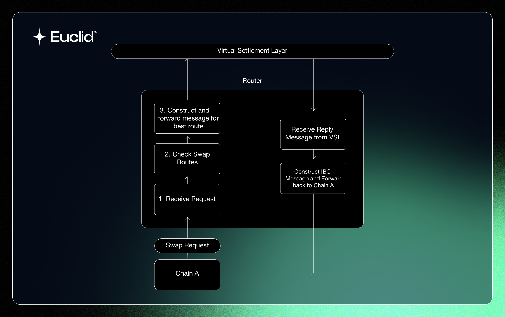

# Router

## Introduction

The Router is a pivotal component within the Euclid layer, designed to manage and facilitate the coordination of liquidity pools and swaps across different chains. It serves as an intermediary layer that routes requests between the virtual settlement layer and the integrated chains, ensuring efficient and secure operations. The primary purpose of the Router contract is to act as the central communication hub that connects different parts of the Euclid layer.

The Router performs the following tasks:

- **Initialization:** The Router is responsible for initializing the [Virtual Balance](../LiquiSync%20Model/Virtual%20Settlement%20Layer/virtual-balances.md) contract. It is also used to register new [Factory](../LiquiSync%20Model/Integrated%20Chains%20Layer/factory.md) contracts on integrated chains.

- **Communication:** The Router contract sends and receives packets to and from the virtual settlement layer. This allows it to coordinate the execution of liquidity and swap operations across different chains. 

- **Handles Replies:** The Router handles replies from various sub-messages and packets and then forwards the results to the appropriate destination. This ensures that the outcomes of requests are appropriately processed and the state is updated accordingly.

