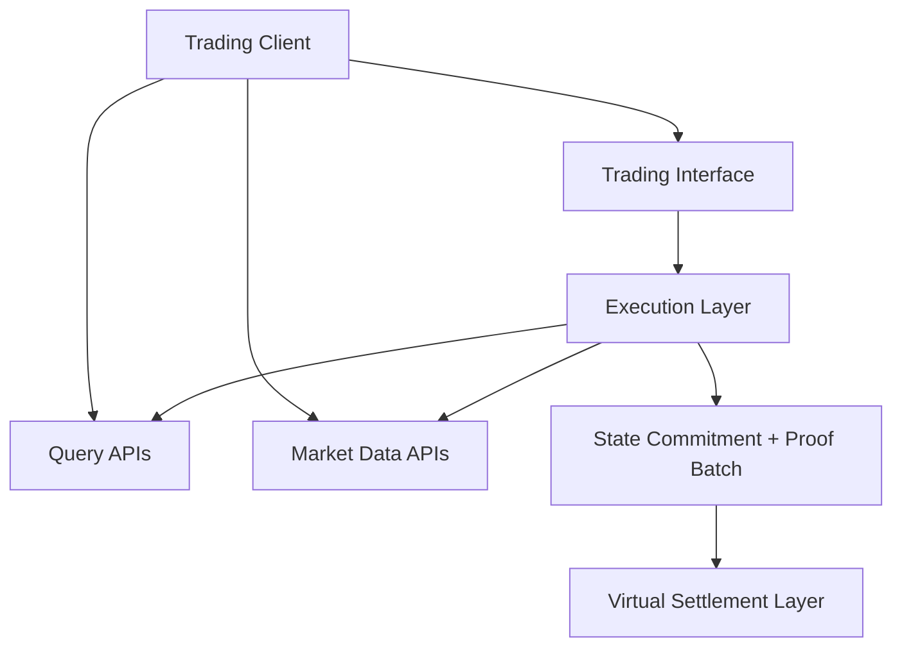

- Audience: Trading API integrators.
- What this page covers: High-level system layers, rollup proof/state flow to VSL, and how API surfaces map to those layers.
- Where to go next: Read [Reliability Model](./reliability.md), then the public interfaces in [Engine API](../developer-reference/engine-api.md), [OMS API](../developer-reference/oms-service.md), and [Market Data API](../developer-reference/market-data.md). For chain-side settlement context, see [Virtual Settlement Layer](../../Architecture%20Overview/Architecture/Virtual%20Settlement%20Layer/virtual-settlement-layer.md).

## Rollup Settlement Model
This orderbook runs as a rollup execution layer:
- Matching is executed offchain for low-latency trading.
- The rollup posts proofs and full state commitments directly to VSL every 2 blocks.
- Settlement and downstream consumers can verify state progression from onchain commitments.

This design is what enables high-throughput matching without trading off decentralization.

## High-Level System Layers
- `Trading interface`: The public trading API where clients place orders, cancel orders, manage balances, and request withdrawals.
- `Execution layer`: The matching system that validates orders, enforces market rules, and computes state transitions.
- `Query layer`: Read-optimized APIs for order history, open orders, and user-facing market views.
- `Market data layer`: Public REST and WebSocket surfaces for depth, trades, and candles.
- `Settlement layer`: The Virtual Settlement Layer, where proofs and full state commitments are published for verification.

## High-Level Request Flow

## What API Users Need to Know
- Writes and reads are intentionally separated: trading requests go through the execution path, while order history and market views are exposed through read-optimized APIs.
- Market data and order-history endpoints are projections of the execution state, so they may lag the trading response briefly.
- Onchain publication to VSL is the public verification boundary for the rollup state.

## Public Surface Mapping
| Need | Use |
| --- | --- |
| Place or cancel trades | [Engine API](../developer-reference/engine-api.md) |
| Fetch open orders or order history | [OMS API](../developer-reference/oms-service.md) |
| Fetch depth, trades, or klines | [Market Data API](../developer-reference/market-data.md) |
| Understand final settlement guarantees | [Virtual Settlement Layer](../../Architecture%20Overview/Architecture/Virtual%20Settlement%20Layer/virtual-settlement-layer.md) |

## Integration Implication
- Use the trading API for actions that change state.
- Use OMS for user-facing order query views.
- Use market-data for charting and live depth or trade streams.
- Treat VSL posting cadence (every 2 blocks) as the verification boundary for rollup state commitments.
