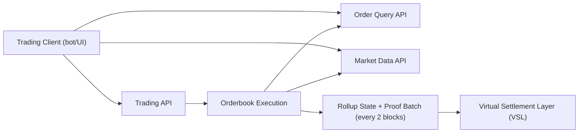

- Audience: Trading API integrators.
- What this page covers: The rollup execution model, who this stack is for, and the three core integration paths.

## What You’re Integrating
This stack is an orderbook rollup: it runs matching offchain for performance, then posts proofs and full state commitments directly to the Virtual Settlement Layer (VSL) every 2 blocks.

That architecture gives integrators two properties at the same time:
- Low-latency, high-throughput matching for trading products.
- Onchain-verifiable state progression for decentralized settlement guarantees.

As an integrator, you typically interact with:
- Trading APIs for order entry, cancellation, balances, and withdrawals.
- Market-data APIs for depth, trades, klines, and live streams.
- Order-query APIs for open orders and order history.

## Who This Is For
This path is designed for developers building:
- Trading bots.
- Exchange and venue connectors.
- Broker adapters.
- Trading UIs that require live depth/trades and accurate order status.

## Integration Paths
1. Trading path
- Authenticate with JWT or API key/secret headers. See [Authentication Headers](../developer-reference/authentication-and-api-keys.md).
- Place, cancel, and replace orders through the trading API.

2. Market-data path
- Read depth, trades, and klines over REST and WebSocket.

3. Account and order-status path
- Read balances from the trading API.
- Read open orders and order history from the query API.

## Rollup Posting Cadence
- Matching happens continuously in the offchain execution layer.
- The rollup posts full state commitments and proofs to VSL every 2 blocks.
- Integrators should treat this cadence as the boundary between execution speed and final onchain verification.

## High-Level Flow

## Read Next
- [Order Lifecycle](./order-lifecycle.md): maps request outcomes (`open`, `partially_filled`, `filled`, `cancelled`, `rejected`) to the APIs you should query after each action.
- [Orderbook Mechanics](../concepts/orderbook-mechanics.md): explains matching behavior, order-type constraints, and market/pair state gates that affect acceptance.
- [Architecture](../concepts/architecture.md): shows how execution, OMS, and market-data projections relate so you can design for consistency windows.
- [Engine API](../developer-reference/engine-api.md): production request/response contract for trading, balances, and withdrawals.
- [Market Data WebSocket](../developer-reference/market-data.md#websocket-channels): channel payloads and runtime key formats needed for real-time feeds.
